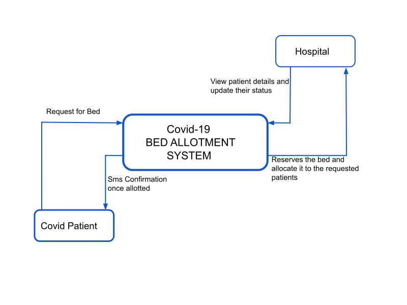

# Hospital Bed Allocation System for Covid-19 Patients

## Description

* Due to covid-19 pandemic, it is difficult to find the hospital beds.
* Patients need to search the entire city for beds for several hours.
* This problem arises due to lack of knowledge about the availability of beds in their locality. 
* So through this project we tried to provide a solution for this problem.

* In this project we tried to bring the patients and hospitals to one platform. Where hospitals provide their bed details which includes number of available beds, occupied beds and details regarding type of beds available. 
* And the patients can make a request by seeing the availability of beds in the district.
* Once the patient makes a request our system will find the availability of  empty beds in that district.
    
* If there is an empty bed, then our system will send a sms notification to the patient's mobile number and system will reserve that bed.
*  At the same time the hospital in which the patient got bed can see the patient details in the hospital home page. 
*  Once the patient receives the bed he has to report to the hospital within 3 hours otherwise the reserved bed will be given to the next requested patient.
    
* If the system finds no beds it will add the patient request to a queue and the request will be processed later when there is an availability of beds.
    
* Other than the patients and the hospitals, a common person can see the availability of beds in all hospitals of all the districts in the website.
* Hospitals can change the status of paitent to discharged/deceased.
* Once the bed is vacated by the patient , our system will check if there is any patient in waiting list.
* If any patient is present then then vacated bed will be allotted to that patient 

## Hardware and Software Requirements:
   
* Can work in any OS

* 4GB RAM

## Technologies used
* Front End
    * HTML
    * CSS
    * Bootstrap
    * Javascript
* Back End 
    * Nodejs
    * Expressjs
* Database
    * MongoDB

## Process Flow:
    
* ### Patient End
  

* ### Hospitals End
  

## Data Flow Diagram:
   

     

 
